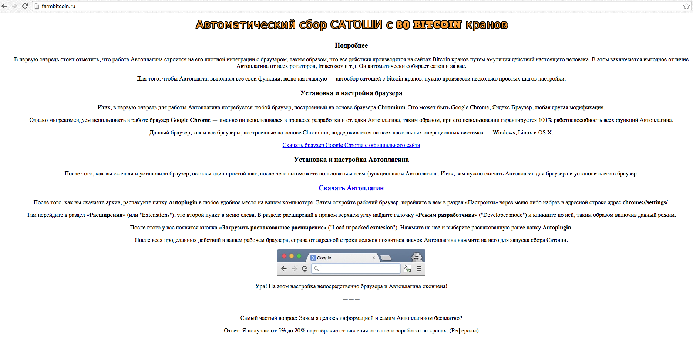
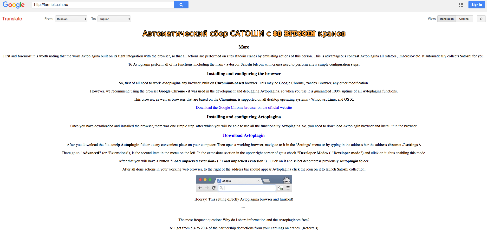

# Static analysis of farmbitcoin-ru Chrome extension

## Disclaimer

This repository may contain source code with malicious logic. Execute at your own risk. I am not responisible for any damage to your data or property. The files are included purely for forensic purposes.

## Obtaining the files

I was directed to a specific domain and web page after reports that many Russian users of this site had experienced the theft of bitcoins.

When visiting the following URL (masked) in Google Chrome on March 9, 2016, a link is provided to a Chrome extension with instructions to download and install it as an unsigned extenion requiring "developer mode".

`hxxp://farmbitcoin.ru/`

WHOIS information for this domain:

```
% By submitting a query to RIPN's Whois Service
% you agree to abide by the following terms of use:
% http://www.ripn.net/about/servpol.html#3.2 (in Russian)
% http://www.ripn.net/about/en/servpol.html#3.2 (in English).

domain: FARMBITCOIN.RU
nserver: ns1.fornex.com.
nserver: ns2.fornex.com.
state: REGISTERED, DELEGATED, VERIFIED
person: Private Person
registrar: REGRU-RU
admin-contact: http://www.reg.ru/whois/admin_contact
created: 2016.04.28
paid-till: 2017.04.28
free-date: 2017.05.29
source: TCI

Last updated on 2016.05.09 22:06:33 MSK
```



The HTML source of this web page is provided in [index.html](web/index.html).

Here is Google's translation of the page:



The instructions make reference to "Avtoplagina", translated into English as "Auto plugin", and provide a download link to Google Chrome and a off-market plugin hosted at the same domain: `hxxp://farmbitcoin.ru/Autoplugin.zip`

Submitting the file to VirusTotal.com [presents the following information](https://www.virustotal.com/en/file/3da8c00e9f138104d948185fc0d587cdd46ba6002145261bec9c05ba7940f48d/analysis/1462817676/):
* SHA256:	3da8c00e9f138104d948185fc0d587cdd46ba6002145261bec9c05ba7940f48d
* Detection ratios: 0 / 56 malicious

The zip file is included in this repository for independent analysis: [Autoplugin.zip](sample/Autoplugin.zip)

The instructions also tell the user how to permit the installation of browser extensiosns that have not gone through Google Chrome's review process, and tell the user to install the "Auto plugin" extension in Google Chrome.

## Unpacking

Once uncompressed, the Autoplugin.zip file contains a packed JavaScript file, [js.js](sample/js.js)

After deobfuscating some of the source using (jsbeautifier.org)[http://jsbeautifier.org/], we obtain a clearer version: [js-beautified.js](sample/js-beautified.js). Substituting array references using [unpack.py](tools/unpack.py), we obtain an unpacked version: [js-unpacked.js](sample/js-unpacked.js).

## Analysis

Brief analysis of the JavaScript reveals that this plugin is intended to inspect the contents of pages loaded in the browser. If the contents match that of specific Bitcoin websites such as blockchain.info, the extension makes substitutions, redirecting bitcoin funds sent by the user to an unintended and malicious recipient. The recipient address, [17gJN422WXBypfsnLuABiaGdWJmhAsDZ6w](https://blockchain.info/address/17gJN422WXBypfsnLuABiaGdWJmhAsDZ6w), has obtained 4.25460671 BTC currently valued at $1,964 USD to date.
